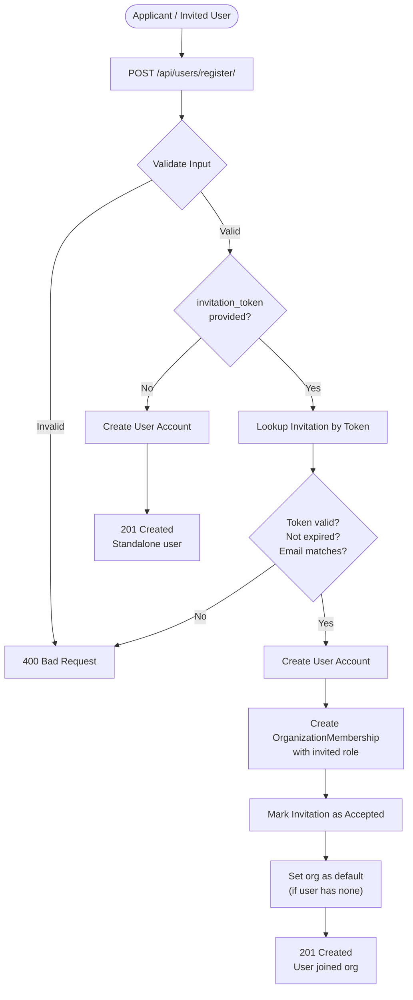
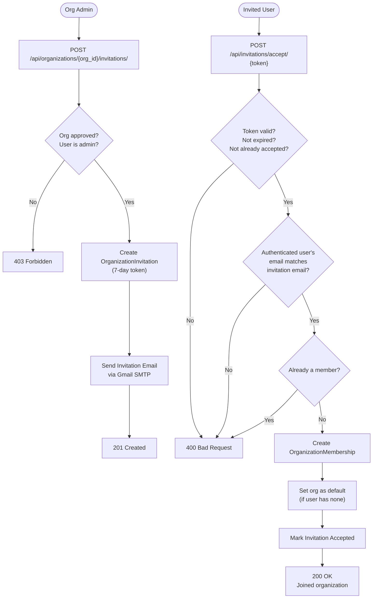
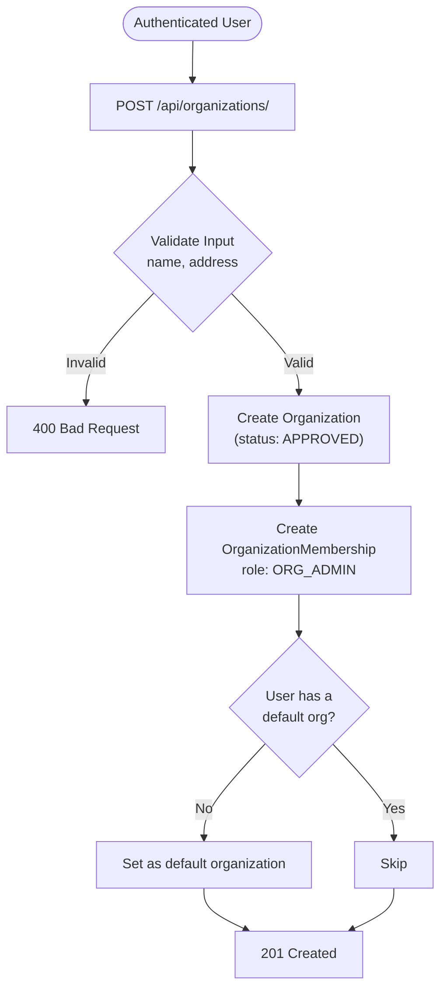
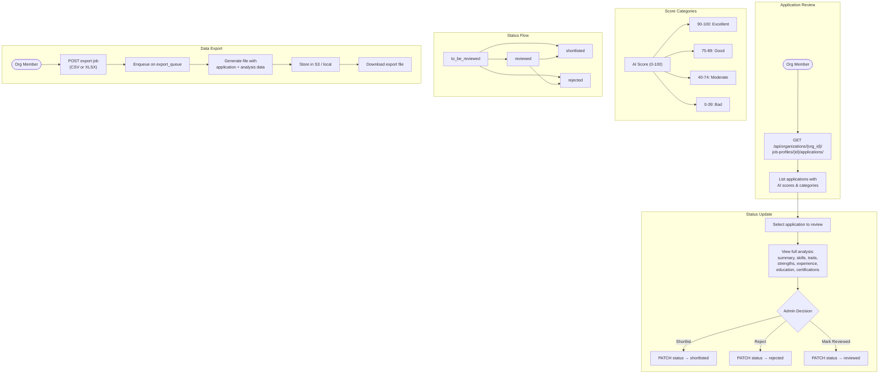

# Business Logic Flows

## User Registration Flow

## Invitation Flow (Existing Users)

## Organization Creation Flow

## Job Profile Creation → Application Submission → Analysis Flow

```mermaid
flowchart TD
    subgraph Job Profile Creation
        Admin([Org Admin]) --> CreateProfile["POST /api/organizations/{org_id}/job-profiles/"]
        CreateProfile --> SaveProfile["Create JobProfile<br/>(title, category, employment type,<br/>experience level, description)"]
        SaveProfile --> AddQuals["Add Qualifications<br/>(skills, experience, education, etc.)"]
        AddQuals --> AddQuestions["Add Questions<br/>(text, MCQ, MCQ single)"]
        AddQuestions --> ProfileReady["Job Profile Active ✓"]
    end

    subgraph Resume Pre-Upload
        Applicant([Applicant]) --> Upload["POST /api/applications/submit/upload/resume/"]
        Upload --> StoreTemp["Store in TemporaryFileUpload<br/>Compute SHA-256 hash<br/>Dedup check"]
        StoreTemp --> ReturnUUID["Return file UUID"]
    end

    subgraph Application Submission
        ReturnUUID --> Submit["POST /api/applications/submit/<br/>(public endpoint, no auth)"]
        ProfileReady -.-> Submit
        Submit --> ValidateApp{Validate:<br/>Profile active?<br/>Required questions answered?}
        ValidateApp -->|Invalid| Error400["400 Bad Request"]
        ValidateApp -->|Valid| CreateApp["Create JobApplication<br/>(status: TO_BE_REVIEWED)"]
        CreateApp --> SaveAnswers["Create QuestionAnswer records"]
        SaveAnswers --> LinkFiles["Link ApplicationAttachments<br/>(from temp uploads)"]
        LinkFiles --> SendConfirm["Send Confirmation Email<br/>to applicant"]
        SendConfirm --> TriggerPipeline["Trigger Analysis Pipeline<br/>(silent fail)"]
    end

    subgraph Analysis Pipeline
        TriggerPipeline --> HasResume{Resume<br/>attached?}
        HasResume -->|No| SkipAnalysis["Skip analysis"]
        HasResume -->|Yes| CreateAnalysis["Create ApplicationAnalysis<br/>(status: UPLOADED)"]
        CreateAnalysis --> EnqueueOCR["Enqueue on ocr_queue<br/>(RQ retry: max 3, 30/60/120s)"]

        subgraph OCR Worker [ocr_queue worker]
            EnqueueOCR --> OCRStart["OCR Worker picks up job"]
            OCRStart --> SetOCRPending["Status → OCR_PENDING"]
            SetOCRPending --> DownloadPDF["Download resume from storage<br/>(S3 or local)"]
            DownloadPDF --> ConvertDocx{DOCX?}
            ConvertDocx -->|Yes| ConvertPDF["Convert to PDF via LibreOffice"]
            ConvertDocx -->|No| ExtractText
            ConvertPDF --> ExtractText["Extract text via Tesseract OCR"]
            ExtractText --> SaveText["Save extracted text<br/>Status → OCR_DONE"]
            SaveText --> EnqueueAI["Enqueue on ai_queue<br/>(no auto-retry)"]
        end

        subgraph AI Worker [ai_queue worker]
            EnqueueAI --> AIStart["AI Worker picks up job"]
            AIStart --> SetAIPending["Status → AI_PENDING"]
            SetAIPending --> CollectContext["Collect job profile data +<br/>qualifications + Q&A pairs"]
            CollectContext --> CallAI["Call OpenAI API<br/>(structured output)"]
            CallAI --> PersistResults["Save: summary, skills,<br/>traits, score_category,<br/>detailed analysis"]
            PersistResults --> Done["Status → DONE"]
        end

        SetOCRPending -->|Any error| OCRAutoRetry{"RQ retries<br/>exhausted?"}
        DownloadPDF -->|Any error| OCRAutoRetry
        ConvertPDF -->|Any error| OCRAutoRetry
        ExtractText -->|Any error| OCRAutoRetry
        OCRAutoRetry -->|No — re-enqueue<br/>w/ backoff| OCRStart
        OCRAutoRetry -->|Yes| FailedOCR["Status → FAILED<br/>error_message saved"]

        SetAIPending -->|Any error| FailedAI["Status → FAILED<br/>error_message saved"]
        CollectContext -->|Any error| FailedAI
        CallAI -->|Any error| FailedAI

        FailedOCR --> ManualRetry["POST /api/applications/{id}/analysis/retry/<br/>Reset → UPLOADED, clear error"]
        FailedAI --> ManualRetry
        ManualRetry --> EnqueueOCR
    end
```

## Shortlisting Flow

