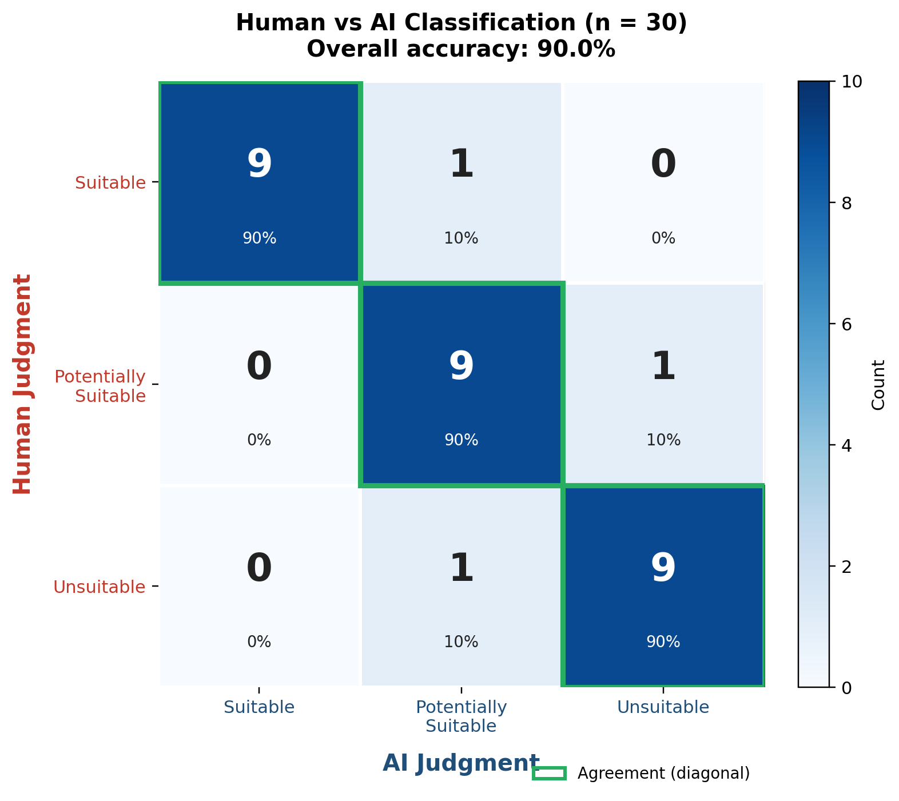

# Validation Against Manually Labeled Ground Truth

## Background and Rationale

To verify that the AI's tier classifications agree with human judgment on a broader pool than the targeted Language Barrier and OCR tests, a confusion matrix was constructed over a manually labeled sample. This is the standard method for comparing a classifier against a human gold standard. It produces a single agreement table that can be summarised into accuracy, per class precision and recall, and a qualitative read on the severity of the disagreements that remain.

## Method

Thirty résumés were drawn from the seeded Barista applicant pool, balanced across the three tiers used by the system (ten Suitable, ten Potentially Suitable, ten Unsuitable). Each résumé was labeled manually by a human reviewer using only the résumé content and the job profile's qualifications, without reference to any AI output. The same thirty résumés were then submitted to the AI screening pipeline, and its classification for each résumé was recorded. The pair (manual label, AI label) was tallied into a three by three matrix. Rows represent the manual label, columns represent the AI label, and the diagonal cells represent cases where the AI agreed with the human reviewer.

## Confusion Matrix

|   | AI: Suitable | AI: Potentially Suitable | AI: Unsuitable | Total |
|---|---|---|---|---|
| **Manual: Suitable** | 9 | 1 | 0 | 10 |
| **Manual: Potentially Suitable** | 0 | 9 | 1 | 10 |
| **Manual: Unsuitable** | 0 | 1 | 9 | 10 |
| **Total** | 9 | 11 | 10 | 30 |

The figure above visualises the same counts. Rows (in red) carry the human reviewer's label, columns (in navy) carry the AI's label, the green outlines mark the agreement diagonal, and each cell shows the absolute count and the percentage of that row.

## Derived Metrics

Overall accuracy is 27 out of 30, or 90.0 percent. The AI matched the human reviewer's label on the diagonal in 27 of 30 cases. Per tier, the AI recalled 9 of 10 Suitable candidates, 9 of 10 Potentially Suitable candidates, and 9 of 10 Unsuitable candidates. None of the disagreements crossed two tiers (for example, no résumé that the human labeled Suitable was classified Unsuitable by the AI, and vice versa). All three disagreements were adjacent tier shifts, which is the mildest form of classification error for a hiring decision support tool because it still surfaces the candidate to the recruiter for review.

## Interpretation

The matrix indicates substantial agreement between the AI and the human reviewer, with errors that are both rare and minor in severity. The absence of any Suitable to Unsuitable misclassification is the practically important result, since that is the failure mode that would cause a hiring tool to silently reject a strong candidate. The AI's behavior on this sample is therefore consistent with its intended role as a decision support layer rather than an autonomous filter.
