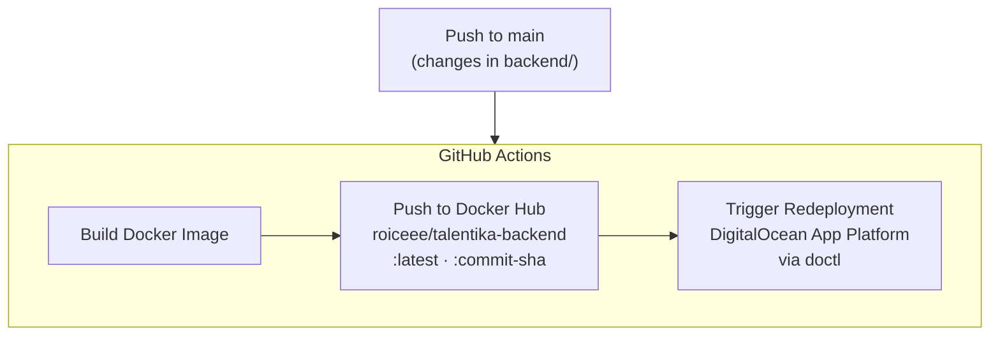

## Server Application Deployment

```mermaid
flowchart TD
    PUSH["Push to main\n(changes in backend/)"]

    PUSH --> GHA

    subgraph GHA["GitHub Actions"]
        BUILD["Build Docker Image"]
        DOCKERHUB["Push to Docker Hub\nroiceee/talentika-backend\n:latest · :commit-sha"]
        DEPLOY["Trigger Redeployment\nDigitalOcean App Platform\nvia doctl"]

        BUILD --> DOCKERHUB --> DEPLOY
    end
```
