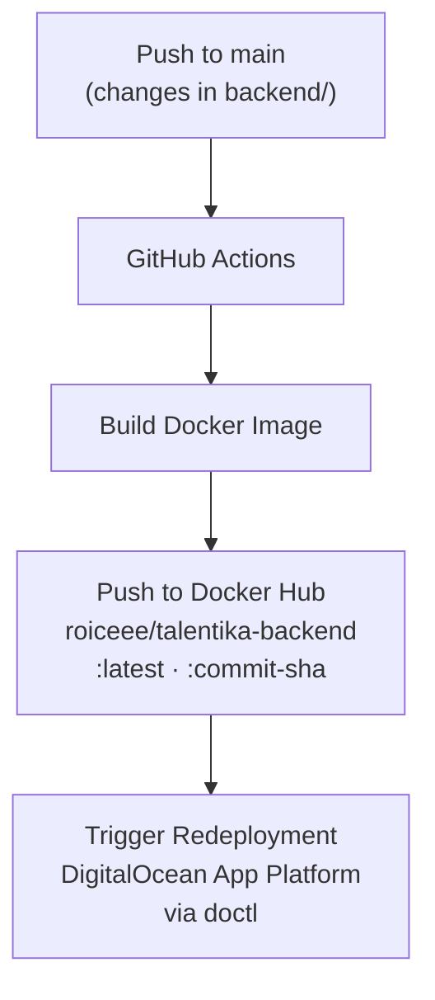

## Server Application Deployment

```mermaid
flowchart TD
    PUSH["Push to main\n(changes in backend/)"]
    GHA["GitHub Actions"]

    PUSH --> GHA

    GHA --> BUILD["Build Docker Image"]
    BUILD --> DOCKERHUB["Push to Docker Hub\nroiceee/talentika-backend\n:latest · :commit-sha"]
    DOCKERHUB --> DEPLOY["Trigger Redeployment\nDigitalOcean App Platform\nvia doctl"]
```
