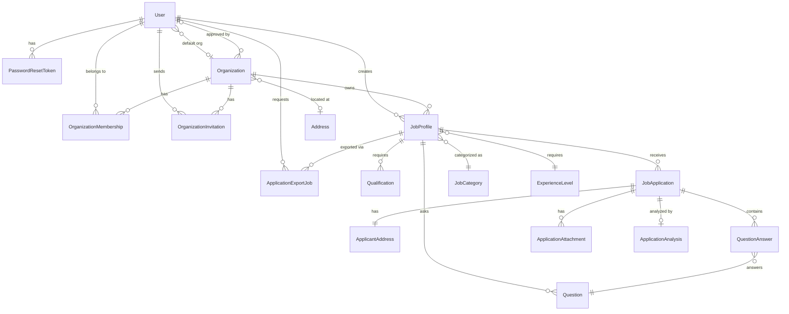

# Entity Relationship Diagram

```mermaid
erDiagram
    User ||--o{ PasswordResetToken : "has"
    User ||--o{ OrganizationMembership : "belongs to"
    User ||--o{ OrganizationInvitation : "sends"
    User ||--o{ JobProfile : "creates"
    User }o--o| Organization : "default org"
    User ||--o{ ApplicationExportJob : "requests"

    Organization ||--o{ OrganizationMembership : "has"
    Organization ||--o{ OrganizationInvitation : "has"
    Organization ||--o{ JobProfile : "owns"
    Organization }o--o| Address : "located at"
    Organization }o--o| User : "approved by"

    JobProfile ||--o{ Qualification : "requires"
    JobProfile ||--o{ Question : "asks"
    JobProfile ||--o{ JobApplication : "receives"
    JobProfile ||--o{ ApplicationExportJob : "exported via"
    JobProfile }o--|| JobCategory : "categorized as"
    JobProfile }o--|| ExperienceLevel : "requires"

    JobApplication ||--|| ApplicantAddress : "has"
    JobApplication ||--o{ QuestionAnswer : "contains"
    JobApplication ||--o{ ApplicationAttachment : "has"
    JobApplication ||--o| ApplicationAnalysis : "analyzed by"

    QuestionAnswer }o--|| Question : "answers"
```
