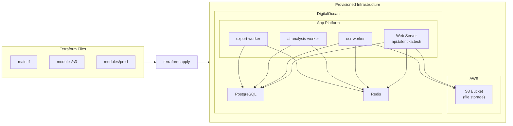

## Production Infrastructure

```mermaid
flowchart LR
    subgraph TF["Terraform Files"]
        direction TB
        A["main.tf"]
        B["modules/s3"]
        C["modules/prod"]
    end

    CMD["terraform apply"]

    subgraph PROD["Provisioned Infrastructure"]
        direction TB
        subgraph AWS["AWS"]
            S3["S3 Bucket\n(file storage)"]
        end
        subgraph DO["DigitalOcean"]
            subgraph AP["App Platform"]
                SERVER["Web Server\napi.talentika.tech"]
                OCR["ocr-worker"]
                AI["ai-analysis-worker"]
                EXPORT["export-worker"]
            end
            PG["PostgreSQL"]
            REDIS["Redis"]
        end
    end

    TF --> CMD --> PROD

    SERVER --> PG
    SERVER --> REDIS
    SERVER --> S3
    OCR --> REDIS
    OCR --> PG
    OCR --> S3
    AI --> REDIS
    AI --> PG
    EXPORT --> REDIS
    EXPORT --> PG
```
