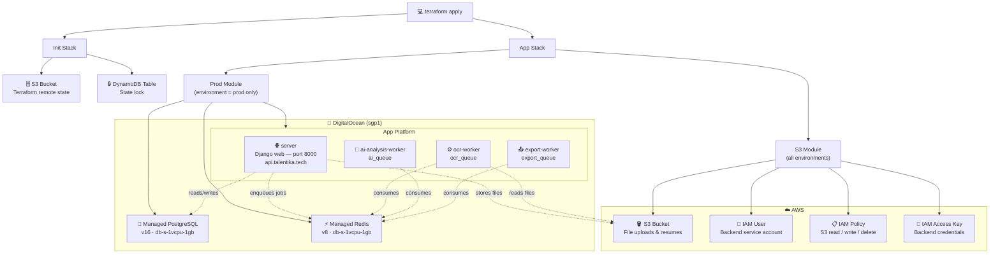

## Infrastructure Diagram

```mermaid
flowchart TD
    DEV["💻 terraform apply"]

    DEV --> INIT["Init Stack"]
    DEV --> APP["App Stack"]

    %% Init Stack
    INIT --> S3_STATE["🗄️ S3 Bucket\nTerraform remote state"]
    INIT --> DYNAMO["🔒 DynamoDB Table\nState lock"]

    %% App Stack branches
    APP --> S3_MOD["S3 Module\n(all environments)"]
    APP --> PROD_MOD["Prod Module\n(environment = prod only)"]

    %% S3 Module — AWS
    subgraph AWS["☁️ AWS"]
        S3_BUCKET["🪣 S3 Bucket\nFile uploads & resumes"]
        IAM_USER["👤 IAM User\nBackend service account"]
        IAM_POLICY["📋 IAM Policy\nS3 read / write / delete"]
        ACCESS_KEY["🔑 IAM Access Key\nBackend credentials"]
    end

    S3_MOD --> S3_BUCKET
    S3_MOD --> IAM_USER
    S3_MOD --> IAM_POLICY
    S3_MOD --> ACCESS_KEY

    %% Prod Module — DigitalOcean
    subgraph DO["🌊 DigitalOcean (sgp1)"]
        subgraph APP_PLATFORM["App Platform"]
            SERVER["🌐 server\nDjango web — port 8000\napi.talentika.tech"]
            OCR_W["⚙️ ocr-worker\nocr_queue"]
            AI_W["🤖 ai-analysis-worker\nai_queue"]
            EXP_W["📤 export-worker\nexport_queue"]
        end

        PG["🐘 Managed PostgreSQL\nv16 · db-s-1vcpu-1gb"]
        REDIS["⚡ Managed Redis\nv8 · db-s-1vcpu-1gb"]
    end

    PROD_MOD --> APP_PLATFORM
    PROD_MOD --> PG
    PROD_MOD --> REDIS

    %% Runtime connections
    SERVER -.->|reads/writes| PG
    SERVER -.->|enqueues jobs| REDIS
    OCR_W -.->|consumes| REDIS
    AI_W  -.->|consumes| REDIS
    EXP_W -.->|consumes| REDIS
    SERVER -.->|stores files| S3_BUCKET
    OCR_W  -.->|reads files| S3_BUCKET
```
