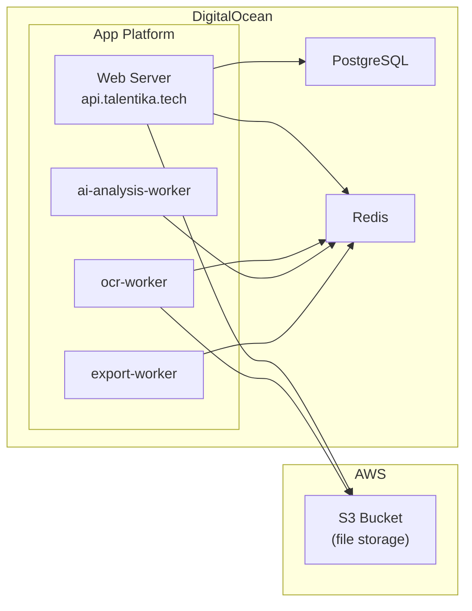

## Production Infrastructure

```mermaid
flowchart LR
    subgraph AWS
        S3["S3 Bucket\n(file storage)"]
    end

    subgraph DigitalOcean
        subgraph App Platform
            SERVER["Web Server\napi.talentika.tech"]
            OCR["ocr-worker"]
            AI["ai-analysis-worker"]
            EXPORT["export-worker"]
        end
        PG["PostgreSQL"]
        REDIS["Redis"]
    end

    SERVER --> PG
    SERVER --> REDIS
    SERVER --> S3
    OCR --> REDIS
    OCR --> S3
    AI --> REDIS
    EXPORT --> REDIS
```
