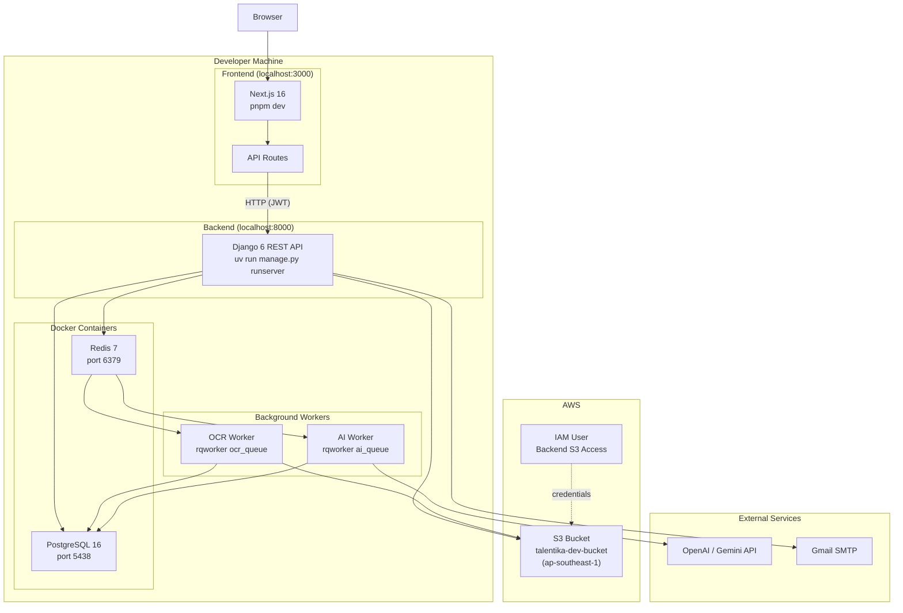
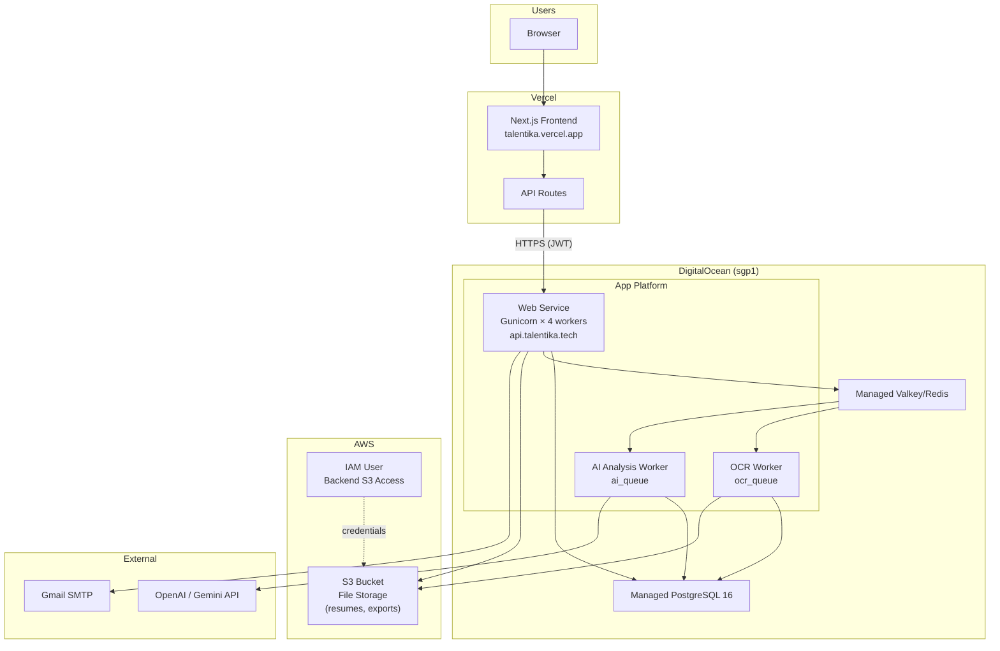
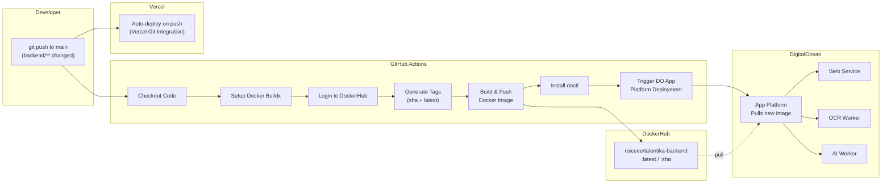
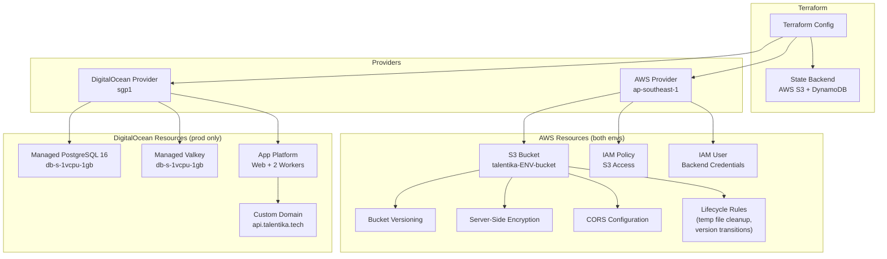

# System Architecture

## Development Setup

```mermaid
graph TB
    subgraph Developer Machine
        subgraph Frontend["Frontend (localhost:3000)"]
            NextJS["Next.js 16<br/>pnpm dev"]
            APIRoutes["API Routes"]
            NextJS --> APIRoutes
        end

        subgraph Backend["Backend (localhost:8000)"]
            Django["Django 6 REST API<br/>uv run manage.py runserver"]
        end

        subgraph Docker Containers
            Postgres["PostgreSQL 16<br/>port 5438"]
            Redis["Redis 7<br/>port 6379"]
        end

        subgraph Workers["Background Workers"]
            OCRWorker["OCR Worker<br/>rqworker ocr_queue"]
            AIWorker["AI Worker<br/>rqworker ai_queue"]
        end

    end

    subgraph AWS
        S3Dev["S3 Bucket<br/>talentika-dev-bucket<br/>(ap-southeast-1)"]
        IAMDev["IAM User<br/>Backend S3 Access"]
    end

    subgraph External Services
        OpenAI["OpenAI / Gemini API"]
        SMTP["Gmail SMTP"]
    end

    APIRoutes -- "HTTP (JWT)" --> Django
    Django --> Postgres
    Django --> Redis
    Redis --> OCRWorker
    Redis --> AIWorker
    OCRWorker --> Postgres
    AIWorker --> Postgres
    AIWorker --> OpenAI
    Django --> S3Dev
    OCRWorker --> S3Dev
    IAMDev -.->|credentials| S3Dev
    Django --> SMTP

    Browser["Browser"] --> NextJS
```

## Production Setup

```mermaid
graph TB
    subgraph Users
        Browser["Browser"]
    end

    subgraph Vercel
        NextJS["Next.js Frontend<br/>talentika.vercel.app"]
        APIRoutes["API Routes"]
        NextJS --> APIRoutes
    end

    subgraph DigitalOcean["DigitalOcean (sgp1)"]
        subgraph AppPlatform["App Platform"]
            Gunicorn["Web Service<br/>Gunicorn × 4 workers<br/>api.talentika.tech"]
            OCRWorker["OCR Worker<br/>ocr_queue"]
            AIWorker["AI Analysis Worker<br/>ai_queue"]
        end

        ManagedPostgres["Managed PostgreSQL 16"]
        ManagedRedis["Managed Valkey/Redis"]
    end

    subgraph AWS
        S3["S3 Bucket<br/>File Storage<br/>(resumes, exports)"]
        IAM["IAM User<br/>Backend S3 Access"]
    end

    subgraph External
        OpenAI["OpenAI / Gemini API"]
        SMTP["Gmail SMTP"]
    end

    Browser --> NextJS
    APIRoutes -- "HTTPS (JWT)" --> Gunicorn
    Gunicorn --> ManagedPostgres
    Gunicorn --> ManagedRedis
    ManagedRedis --> OCRWorker
    ManagedRedis --> AIWorker
    OCRWorker --> ManagedPostgres
    AIWorker --> ManagedPostgres
    AIWorker --> OpenAI
    Gunicorn --> S3
    OCRWorker --> S3
    IAM -.->|credentials| S3
    Gunicorn --> SMTP
```

## CI/CD Pipeline

```mermaid
graph LR
    subgraph Developer
        Push["git push to main<br/>(backend/** changed)"]
    end

    subgraph GitHub Actions
        Checkout["Checkout Code"]
        BuildX["Setup Docker Buildx"]
        Login["Login to DockerHub"]
        Meta["Generate Tags<br/>(sha + latest)"]
        Build["Build & Push<br/>Docker Image"]
        InstallDoctl["Install doctl"]
        Deploy["Trigger DO App<br/>Platform Deployment"]

        Checkout --> BuildX --> Login --> Meta --> Build
        Build --> InstallDoctl --> Deploy
    end

    subgraph DockerHub
        Image["roiceee/talentika-backend<br/>:latest / :sha"]
    end

    subgraph DigitalOcean
        AppPlatform["App Platform<br/>Pulls new image"]
        Web["Web Service"]
        OCR["OCR Worker"]
        AI["AI Worker"]
        AppPlatform --> Web
        AppPlatform --> OCR
        AppPlatform --> AI
    end

    subgraph Vercel
        Frontend["Auto-deploy on push<br/>(Vercel Git Integration)"]
    end

    Push --> Checkout
    Push --> Frontend
    Build --> Image
    Deploy --> AppPlatform
    Image -.->|pull| AppPlatform
```

## Infrastructure Management (Terraform)

```mermaid
graph TB
    subgraph Terraform
        TFState["State Backend<br/>AWS S3 + DynamoDB"]
        TFConfig["Terraform Config"]
    end

    subgraph Providers
        AWSProvider["AWS Provider<br/>ap-southeast-1"]
        DOProvider["DigitalOcean Provider<br/>sgp1"]
    end

    subgraph "AWS Resources (both envs)"
        S3Bucket["S3 Bucket<br/>talentika-ENV-bucket"]
        S3Versioning["Bucket Versioning"]
        S3Encryption["Server-Side Encryption"]
        S3CORS["CORS Configuration"]
        S3Lifecycle["Lifecycle Rules<br/>(temp file cleanup,<br/>version transitions)"]
        IAMPolicy["IAM Policy<br/>S3 Access"]
        IAMUser["IAM User<br/>Backend Credentials"]
    end

    subgraph "DigitalOcean Resources (prod only)"
        DOPostgres["Managed PostgreSQL 16<br/>db-s-1vcpu-1gb"]
        DORedis["Managed Valkey<br/>db-s-1vcpu-1gb"]
        DOApp["App Platform<br/>Web + 2 Workers"]
        DODomain["Custom Domain<br/>api.talentika.tech"]
    end

    TFConfig --> AWSProvider
    TFConfig --> DOProvider
    TFConfig --> TFState
    AWSProvider --> S3Bucket
    S3Bucket --> S3Versioning
    S3Bucket --> S3Encryption
    S3Bucket --> S3CORS
    S3Bucket --> S3Lifecycle
    AWSProvider --> IAMPolicy
    AWSProvider --> IAMUser
    DOProvider --> DOPostgres
    DOProvider --> DORedis
    DOProvider --> DOApp
    DOApp --> DODomain
```
