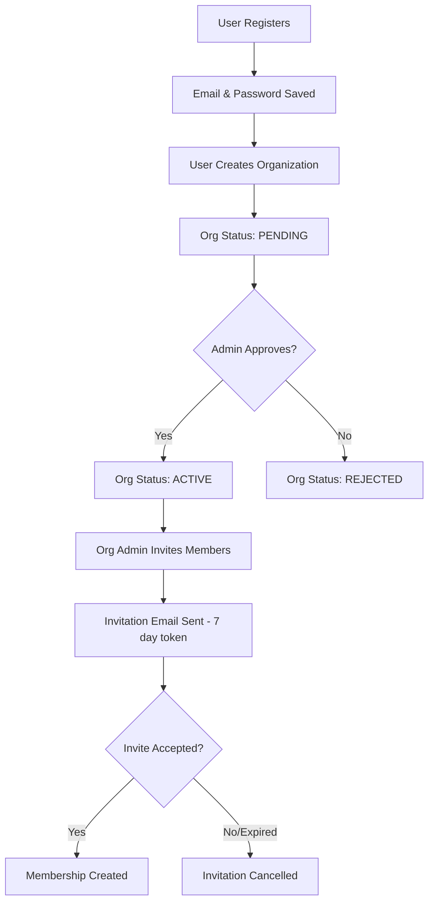
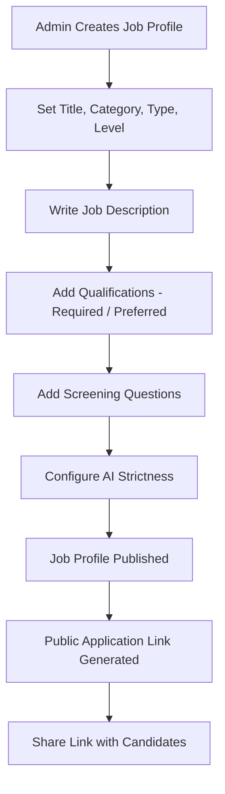
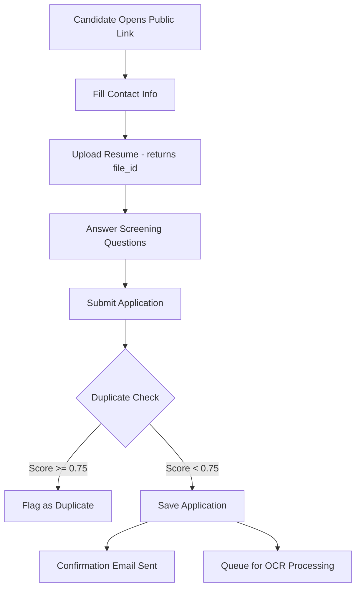
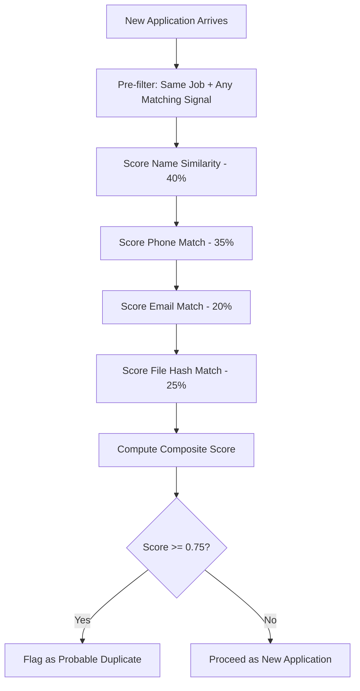
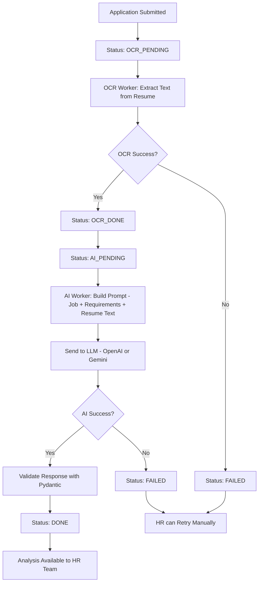
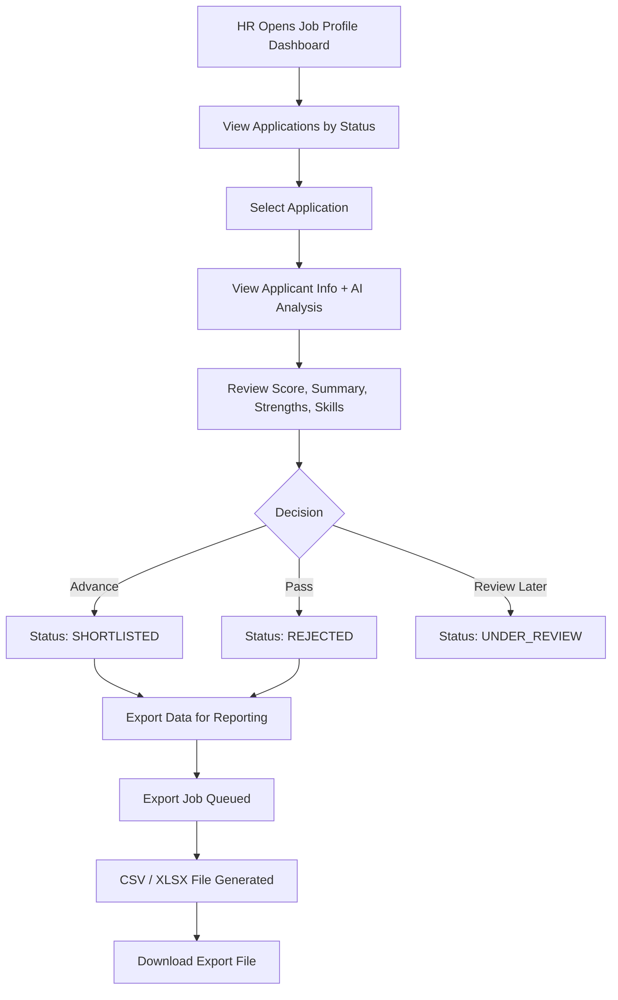

# Business Logic Flows

## 1. User Registration & Organization Setup

---

## 2. Job Profile Creation

---

## 3. Candidate Application Submission

---

## 4. Duplicate Detection

---

## 5. AI Analysis Pipeline

---

## 6. HR Review & Application Management

